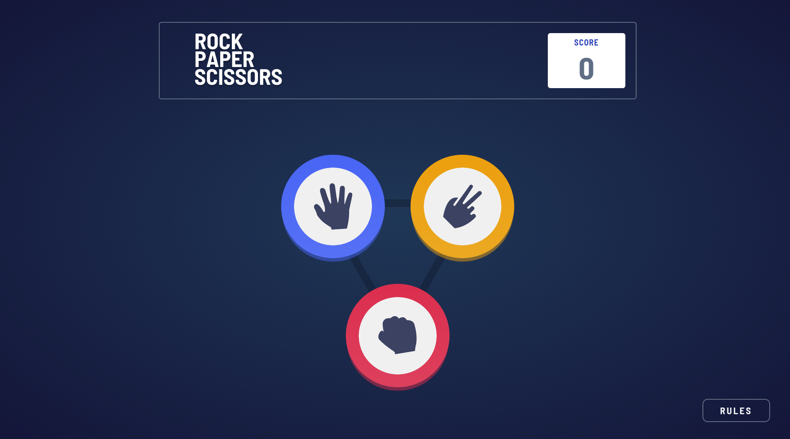
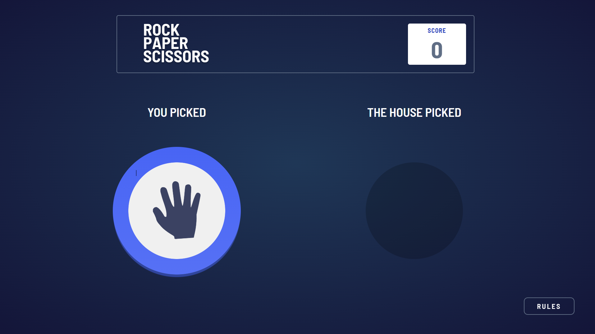
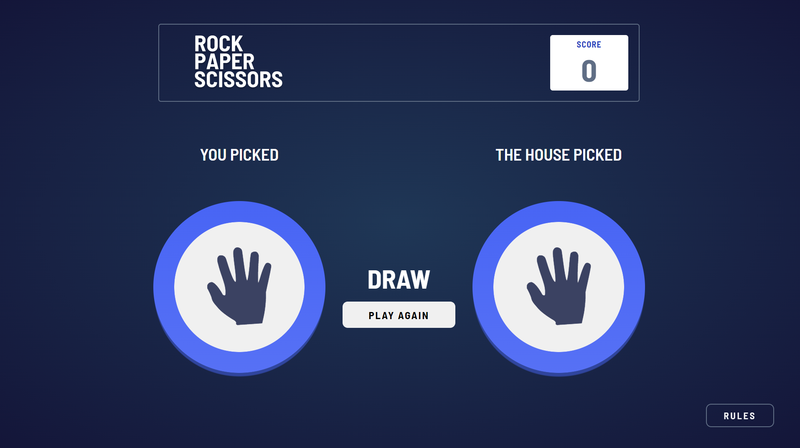
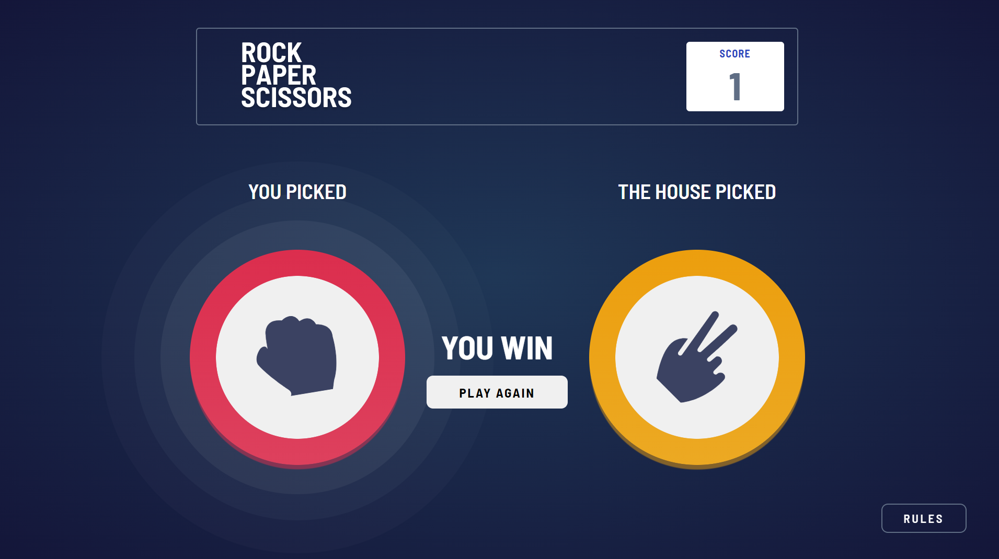
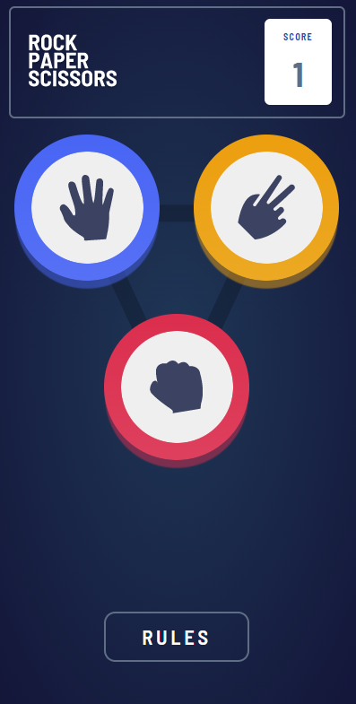
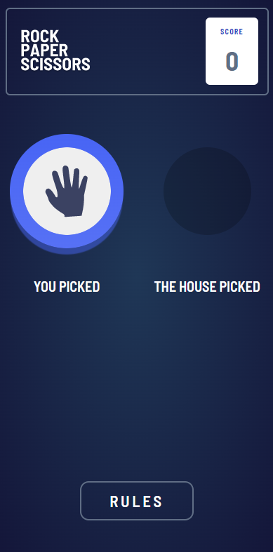
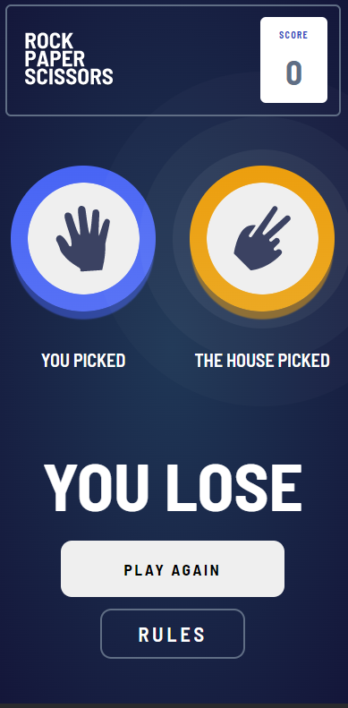
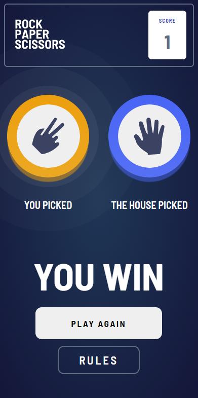

# Frontend Mentor - Multi-step form

Projekt z [Frontend Mentor](https://www.frontendmentor.io)

### **Rozwiązanie z SS'ami znajduje się na samym dole**

## **Projekt**

Prosta gra Rock Paper Scissors w wersji mobile i desktop

## TechStack:
   TypeScript(Pierwszy raz użyty)
   React
   Redux
   Sass

## **Doświadczenie wyniesione z projektu**

   Głownym celem tego projektu była nauka TypeScriptu. Co nie wiedziałem to doczytałem i mam nadzieje że wyszło ok.

## **Rozwiązanie**

### **Desktop**

### **Mobile**

 

 

 

